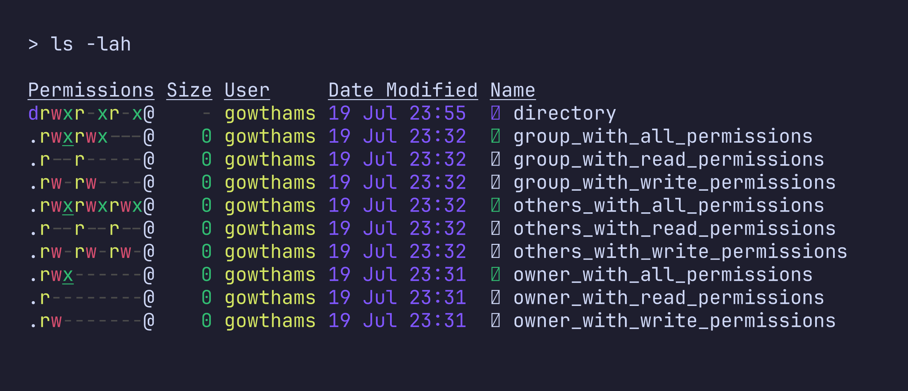

+++
date = '2026-07-19T15:50:18+05:30'
title = 'Linux File Permissions — The Magic of Restrictions Hidden in Plain Sight'
url = '/linux-file-permissions-the-magic-of-restrictions-hidden-in-plain-sight'
description = "Understanding Linux file permissions, ownership and why they matter."
draft = false
tags = ["linux", "file system", "linux permissions", "tech", "open source"]
keywords = ["linux file system", "linux permissions", "linux", "open source"]
+++

I think it's been around **5 years**, I switched to `linux`. I also try to understand `linux` deeply, through config, `unix tools`, using `CLI tools` and so on...
But I never tried to truly understand how `linux file permission` works. when i want to execute a file, I always used:

```sh
chmod +x <script_file>
```

But recently I explored on how there `permissions` works and why is it important, and why one should learn about it

### What are Permissions and Ownership?

`Permission` goes hand in hand with `ownership`. Permission define who can access a `file` or `directory` and what actions they are allowed to perform.

### Types of Permission

- `read(r)`: These permissions decide whether a file can or cannot be read.
- `write(w)`: These permissions determine whether a file can be `modified`.
- `execute(x)`: These permissions determine whether a file can be `executed` as a `program`, required for `scripts` and `binaries`.

> Without execute permission on a directory, you cannot traverse or access files inside it, even if you know their names.
>
> `Executable binaries` require execute permission to be run.

### Why permissions matters

I always wondered and sometimes annoyed to change a file permission and work with it. But as I work on many things for some time, I understand the importance of permissions. It's always recommended to just give the **minimum/enough** permission to avoid unwanted complications. Because, **minimum required permissions** allow an account to work on the requirements, but also restricts the accounts from accessing **unwanted files** or **operations they shouldn't perform**.

> Always restrict the account to only work on what they needed to work on

### Types of accounts
- `owner`: The owner is the account, which have access to modify the permission of a file.
- `group`: A group is like a pool/group of `users`, who share `same permissions`.
- `others`: `others` are all other users, who are neither the `current user` nor a `user` belongs the same `user group` of the file.

### An example of permissions



The first column in the images shows how every type of `account` have different versions of `permissions`:

- The first `./-/d` defines, whether a `node` is a `file` or a `directory`. `./-` defines a `file`, while `d` defines a directory
- The next three represents the permission allowed for the `owner`, like whether the `owner` have `read`, `write` and `execute` access.
- The next three represents the permission allowed for the `user group`.
- The next three represents the permission allowed for the `others`.

### How to change permissions?

When dealing with changing permissions in `linux`, it can be handled in 2 ways:

- whether to change the `ownership` of the file.
- whether to change the `permission` of the file without affecting the ownership.

### Changing the ownership of a file

To change the ownership of a file, we use:

```sh
chown <user_name> <file_name>               # to change the ownership to a user
# or
chown <user_name>:<group_name> <file_name>  # to change the ownership to a user alongside the user group
```

### Changing the permission of a file

To understand how to change the permission of a file, first we need to understand the `linus permission numbering system`. `linux` uses a numerical method to identify file permissions

- 4 — read access
- 2 — write access
- 1 — execute access

> Any combination of these can be used, like `0(---), 6(rw-), 5(r-x), 3(-wx)`.

now to change the permission, use:

```sh
chmod
    <4/2/1/6/5/3>\ # owner permission
    <4/2/1/6/5/3>\ # group permission
    <4/2/1/6/5/3>\ # others permission
<file_name>
```

### Common file permissions

some of common file permissions include:

- 644 - File Baseline
- 755 - Directory Baseline
- 400 - Key Pair

### Conclusion

Understanding permissions helped me understand why restrictions play such an important role in any system.
